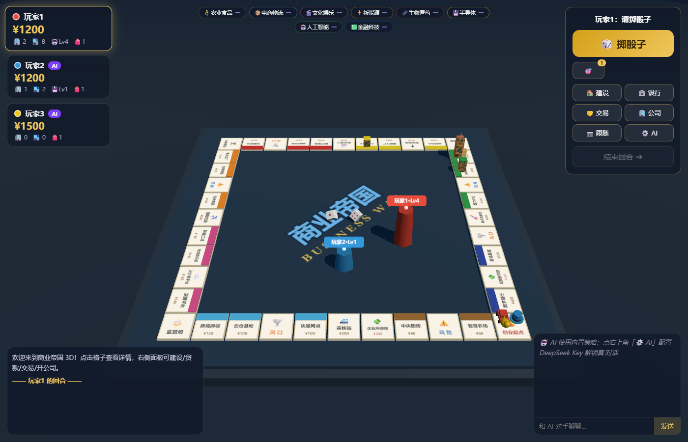
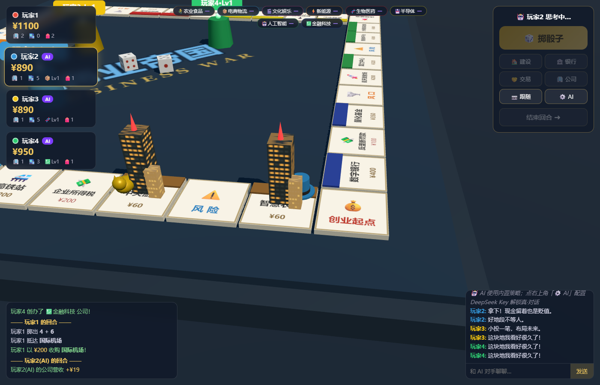
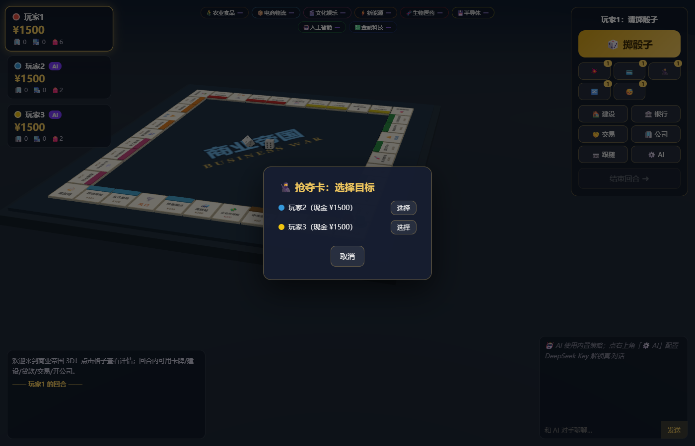

# 商业帝国 3D · AI 大富翁（Monopoly 3D AI）

基于 **Three.js** 的 3D 大富翁游戏：现代商业题材、**DeepSeek 大模型驱动的 AI 对手**、**2~34 人**同屏、**回合制联机对战**、卡牌玩法、行业景气、银行贷款与抵押、创办公司。



## ✨ 特性

- **3D 棋盘**：40 格现代商业棋盘（大模型实验室、算力中心、晶圆工厂…），摩天楼随等级长高、公司总部大楼、6 种棋子造型、真实 3D 骰子（1/4 红点中式传统）、智能跟随镜头
- **DeepSeek AI 对手**（需配置 API Key）：购地决策、交易谈判、局内聊天、部分回合经营走官方 Chat Completions；未配置 Key 时**全程本地启发式**（不是 DeepSeek）
- **卡牌玩法**：遥控骰子/加速卡/免租卡/拆迁卡/均富卡/抢夺卡/换地卡/冬眠卡，回合内自由打出
- **现代经济系统**：8 大行业景气度（低迷/平稳/向好/火爆）影响租金与营收、行业新闻事件、银行贷款（利滚利）、地产抵押赎回、创办并升级公司
- **2~34 人同屏**：本地热座 + AI 混编，大人数自动紧凑布局
- **回合制联机**：WebSocket 权威服务器 + 房间制（4 位房号），2~34 人，掉线 AI 托管
- **单机自动存档**：刷新页面不丢进度，随时继续对局
- **程序化音效**：纯 WebAudio 合成，零音频资源



## 🚀 快速开始

```bash
npm install
npm run dev        # 单机/热座：http://localhost:5173
```

联机对战（回合制）：

```bash
npm run server     # 终端1：对战服务器（默认 :8081）
npm run dev        # 终端2：游戏页面 → 开始界面点「🌐 联机对战」
```

创建房间得到 4 位房号，好友输入房号加入（局域网填房主 IP）。


## 🤖 接入 DeepSeek

1. 打开 [platform.deepseek.com](https://platform.deepseek.com/api_keys) 申请 API Key  
2. 游戏内「⚙️ AI」填入 Key，选择模型（默认 `deepseek-v4-flash`）  
3. 点「测试连接」确认  

- **Base URL**：`https://api.deepseek.com`（OpenAI 兼容 `/chat/completions`）  
- 开发服务器通过 Vite 代理 `/ds` → 官方 API，规避浏览器 CORS  
- Key 只存本机 `localStorage`，不经过自建后端  
- 官方文档：<https://api-docs.deepseek.com/zh-cn/>  

| 有 Key | 无 Key |
|--------|--------|
| 购地 / 交易还价 / 聊天 / 部分经营 = DeepSeek | 全部本地规则 + 内置台词 |

模型：`deepseek-v4-flash`、`deepseek-v4-pro`（旧名 `deepseek-chat` / `deepseek-reasoner` 兼容至 2026-07-24）。

## 🃏 卡牌



## 🏗️ 技术架构

```
src/
├─ data/      棋盘/卡牌/行业/道具定义（纯数据）
├─ core/      state.js 规则状态 + engine.js 回合引擎（纯逻辑，无 DOM/Three 依赖）
├─ llm/       DeepSeek 客户端 + AI 人格大脑（决策/谈判/闲聊，含本地回退）
├─ three/     world.js 3D 世界（棋盘/棋子/摩天楼/总部/骰子/智能镜头）
├─ ui/        ui.js HUD/弹窗/银行/交易/公司/聊天
├─ net/       online.js 联机客户端
├─ audio.js   WebAudio 程序化音效
server/       server.mjs 联机权威服务器（房间制，复用 core 引擎）
test/         无头仿真 / 参数平衡 / 浏览器冒烟 / 联机仿真 / 双浏览器 / 存档 / 视觉检查
```

规则引擎与表现层完全分离（引擎通过 adapter 注入表现层），同一引擎驱动单机、联机服务器与无头仿真。

## 🧪 测试

```bash
npm run sim        # 300 局无头规则仿真（含 34 人局，不变量校验）
npm run balance    # 27 组经济参数扫描（2700 局）
npm run smoke      # 浏览器冒烟（Playwright）
npm run net-sim    # 联机协议仿真
npm run net-web    # 双浏览器联机对局
```

## 📄 开源协议

[MIT](LICENSE) © hencter

> 相关仓库：[monopoly-engine](https://github.com/hencter/monopoly-engine) —— 从本项目抽出的无头大富翁规则引擎与仿真器。
